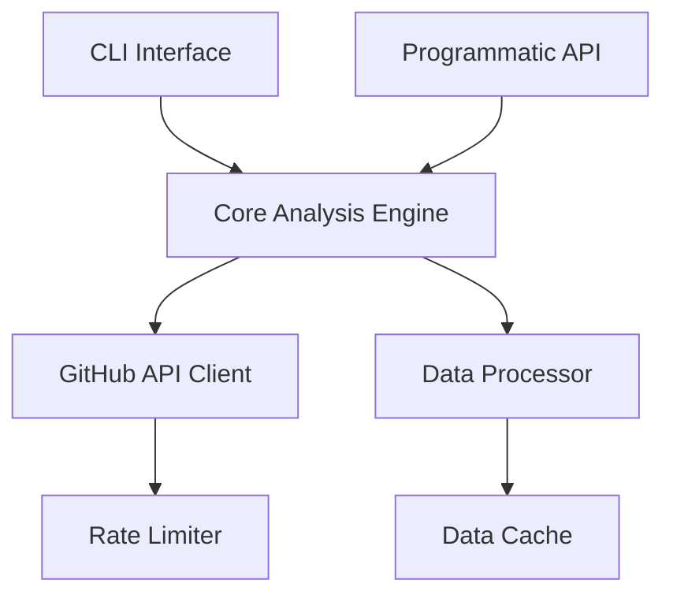

# System Patterns: github-workhours

## Architecture Overview
The package follows a modular architecture with clear separation of concerns:

## Key Components
1. **CLI Interface**: Command-line tool for running analyses
2. **Programmatic API**: JavaScript interface for integration
3. **GitHub API Client**: Handles all GitHub API interactions
4. **Rate Limiter**: Ensures API usage stays within limits
5. **Data Processor**: Analyzes raw commit data
6. **Data Cache**: Stores results to minimize API calls

## Design Patterns
- **Functional Clean Architecture**: Single-purpose functions in separate files
- **Factory Functions**: Dependency injection through factory functions (e.g., `makeUser`)
- **Repository Pattern**: Abstracts data access logic
- **Strategy Pattern**: Pluggable analysis strategies
- **Factory Pattern**: Creates appropriate analyzers based on parameters
- **Observer Pattern**: Monitors and reacts to rate limit changes
- **Command Pattern**: Encapsulates analysis requests

## Data Flow
1. User initiates analysis via CLI or API
2. System fetches repository list for organization
3. For each repository, system fetches commit history
4. Commit data is processed to extract timing patterns
5. Results are aggregated by contributor
6. Final analysis is returned in JSON format

## Optimization Strategies
- Incremental data fetching to avoid redundant API calls
- Local caching of previously fetched data
- Parallel processing where appropriate
- Backoff strategies for rate limit handling
